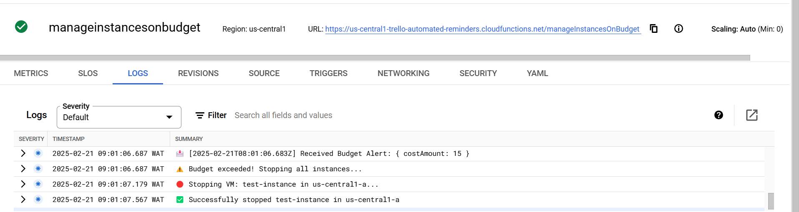
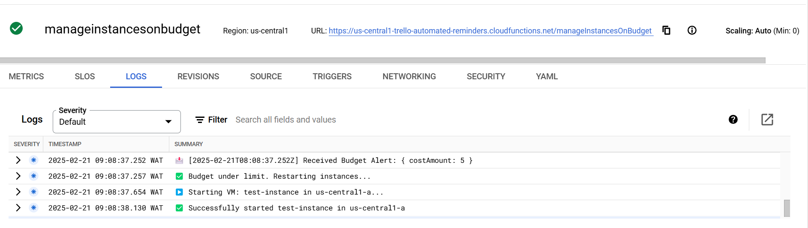

# 📌 Google Cloud Budget Automation – Stop & Start VMs

## 🖥️ Overview

This Cloud Function **automates instance management** based on budget alerts from Google Cloud Billing.

- **If budget exceeds $10** → **Stops all instances**
- **If budget is below $10** → **Restarts all instances**

It listens for budget alerts via **Google Pub/Sub** and takes action accordingly. The automation works with any billing account that sends alerts to the configured `budget-alerts` topic.

## 🚀 Setup & Deployment Guide

### 1️⃣ Prerequisites

Ensure you have the following:

- ✅ **Google Cloud Project** with **Compute Engine & Cloud Functions enabled**
- ✅ **Billing Alerts & Budgets configured**
- ✅ **Pub/Sub topic** (`budget-alerts`) linked to the budget
- ✅ **IAM roles** assigned to service accounts

### 2️⃣ Deploying the Function

#### 💡 Step 1: Clone the Repository

```sh
git clone https://github.com/YOUR_GITHUB_USERNAME/budget-automation.git
cd budget-automation
```

#### 💡 Step 2: Install Dependencies

```sh
npm install
```

#### 💡 Step 3: Deploy the Cloud Function

```sh
gcloud functions deploy manageInstancesOnBudget \
    --runtime=nodejs20 \
    --trigger-topic=budget-alerts \
    --service-account=budget-automation-sa@YOUR_PROJECT_ID.iam.gserviceaccount.com \
    --region=us-central1 \
    --allow-unauthenticated
```

🚀 This deploys the function to **Google Cloud Functions** and links it to the **budget-alerts Pub/Sub topic**.

## ⚙️ How It Works

### 🔹 Step 1: Receiving Budget Alerts

1. The function listens to **budget-alerts** from **Google Cloud Billing**
2. It **extracts the budget amount** (`costAmount`)
3. **If** `costAmount` >= 10 → It **stops all Compute Engine instances**
4. **If** `costAmount` < 10 → It **restarts all stopped instances**

### 🔹 Step 2: Stopping/Starting Instances

#### 🔴 Stopping VMs:

- Lists **all running instances**
- Calls **Google Compute API** to stop them

#### ▶️ Starting VMs:

- Lists **all stopped instances**
- Calls **Google Compute API** to restart them

### 🔹 Step 3: Multi-Budget Support

The automation is designed to work with multiple budget sources:

- Function listens to the `budget-alerts` Pub/Sub topic
- **Any budget** (including main billing account) that publishes to this topic will trigger the automation
- All budget alerts are processed identically:
  - Same threshold rules apply ($10 limit)
  - Same instance management actions (stop/start)
- This allows for centralized budget control across different billing accounts

## 📊 Monitoring and Alerts

### 📝 Monitoring Logs

You can view real-time logs in Google Cloud by navigating to Cloud Functions → Logs. You'll see entries like:

```
📩 Received Budget Alert
⚠️ Budget exceeded! Stopping all instances...
✅ Successfully stopped [instance-name] in [zone]
```

### 📧 Email Alerts

- Email notifications are sent whenever the budget limit is exceeded
- Configured email address: noodzakelijkonline@gmail.com
- If you haven't received alerts, contact support to verify notification setup

### 🧪 Testing

You can manually test the automation:

- Trigger the function to simulate an over-budget scenario
- This will stop instances and generate logs
- Customize budget thresholds by modifying the Pub/Sub topic configuration

## 🔑 IAM Permissions Needed

For the **service account** (`budget-automation-sa@YOUR_PROJECT_ID.iam.gserviceaccount.com`), assign these **IAM roles**:

| Role                             | Purpose                              |
| -------------------------------- | ------------------------------------ |
| `roles/compute.instanceAdmin.v1` | Manage Compute Engine instances      |
| `roles/pubsub.subscriber`        | Listen to budget alerts from Pub/Sub |
| `roles/cloudfunctions.invoker`   | Allow invoking the Cloud Function    |

✅ Assign roles using:

```sh
gcloud projects add-iam-policy-binding YOUR_PROJECT_ID \
    --member="serviceAccount:budget-automation-sa@YOUR_PROJECT_ID.iam.gserviceaccount.com" \
    --role="roles/compute.instanceAdmin.v1"
```

## 🛠️ Debugging

Check logs in **Google Cloud Console**:

```sh
gcloud functions logs read manageInstancesOnBudget
```

If Pub/Sub isn't triggering:

```sh
gcloud pubsub subscriptions pull projects/YOUR_PROJECT_ID/subscriptions/budget-alerts-sub --auto-ack
```

## 📜 Code Structure

```
📂 budget-automation/
┣ 📜 index.js     # Main Cloud Function logic
┣ 📜 package.json # Dependencies & scripts
┣ 📜 README.md    # Documentation
```

## 📊 Budget Status Visualization

### When Budget Exceeds Limit:



### When Budget is Within Limit:



## ✅ Conclusion

- This function **automates Google Cloud instance management** based on **budget alerts**
- Supports **any billing account** as long as it publishes to the `budget-alerts` Pub/Sub topic
- Fully **configurable** and **easy to deploy**
